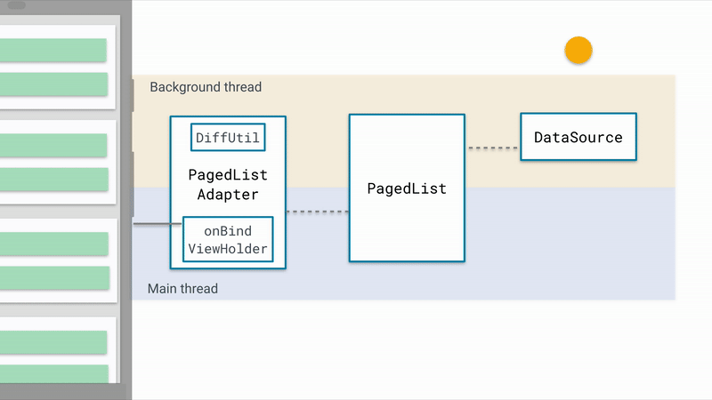

# blaze-downloader
An image and Json downloading library with InMemory LRU cache.

I will support more data types in future

# Blaze Downloader App
A sample android app that shows how to use blaze-downloader to download images from CDN and also how to fetch Json.
For now I have used a static URL -> https://pastebin.com/raw/wgkJgazE to fetch the Json data as the example suggested.

### Implemented by Clean Architecture
The following diagram shows the structure of this project with 3 layers:
- Presentation
- Domain
- Data

 

  

 

### Communication between layers

1. UI calls method from ViewModel.
2. ViewModel triggers data fetch from repository(using blaze-downloader), 
   parses the data and stores locally in InMemory database to cater pagination.
3. blaze-downloader saves the images usning LRU caching and spills the images to the adapter to render.
4. Each Repository returns data from a Data Source (Cached or Remote).
5. Information flows back to the UI where we display the list of posts.

### Scenario
Used  https://pastebin.com/raw/wgkJgazE/ as a public api to fake data for this sample app.

At a glance:

- Download all posts using blaze-downloader.
- Show the downloaded images using LRU caching.
- Added pagination using InMemory database for better user experience.

